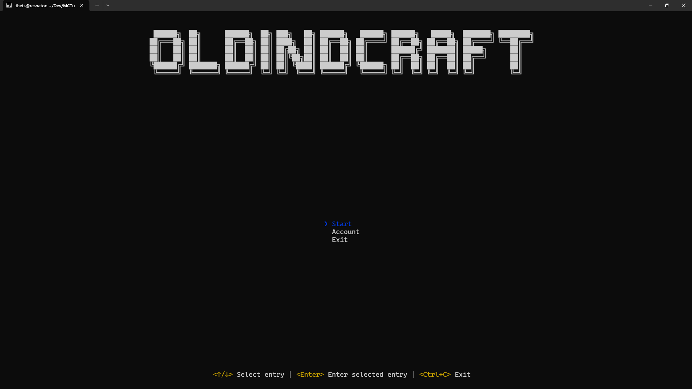

# OldIndCraft Launcher

## How to use

You must have Node.JS and npm installed on your machine. Refer to [the official Node documentation for instructions](https://nodejs.org/en/download/package-manager/current)

- Rename `settings.example.json` to `settings.json`
- Run `npm install`
- Run `npm run start`
